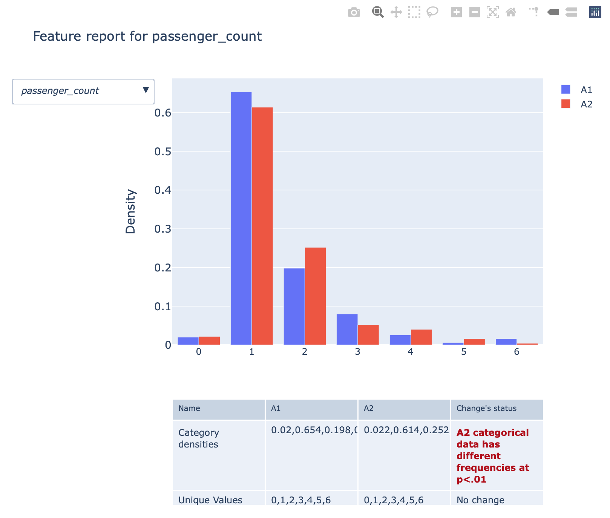

# ff3

**ff3** is a library for creating statistical reports and visualizations based on sample
datasets. It can help you to detect domain drifts on your data and create low-dimensional projections.

# Installation

```sh
pip install ff3
```

# Usage

## DriftReport

In this section you'll find examples on how to use ff3 library to create drift reports.

ff3.DriftReport creates a statistical report based on a comparison between given datasets distributions. It compares them by a set of statistical tests and finds deviations.

```python
import pandas as pd
from ff3 import DataDrift

df1 = pd.read_csv("yesterday-data.csv")
df2 = pd.read_csv("today-data.csv")

drift = DriftReport(d1, d2)
drift.eval()
drift.detailed_report()  # create an interactive report
```
 


In case you want to find out relationship between two distinct features, you can create
a bivariate report.

```python
drift.bivariate_report("passenger_count", "tip_amount")
```


You can de/serialize DriftReport instance if required. 

```python
serialized = drift.to_dict()
drift2 = DriftReport.from_dict(serialized)
drift2.detailed_report()
```